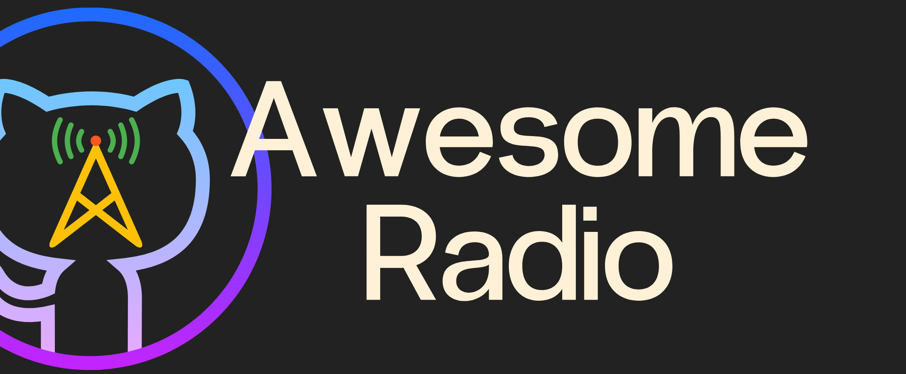

# [Awesome Radio](https://github.com/bcanata/awesome-radio) 

**A collection of useful stuff for Ham Radio**  

You can also contribute!

## Android Apps

App Name | Description
---- | ----
[Look4Sat](https://play.google.com/store/apps/details?id=com.rtbishop.look4sat&hl=en_US&gl=US) 			| Tracks satellite passes and gives transponder data of the satellites.

## Who am I?

I am a newbie Ham Radio operator with the callsign **TA1ANW**. You can visit my other medium to learn more and contact me.

 - Twitter: [@bugrateacher](https://twitter.com/bugrateacher)
 - Facebook: [Buğra CANATA](https://www.facebook.com/canata)
 - Personal Website: [bugracanata.com.tr](https)
